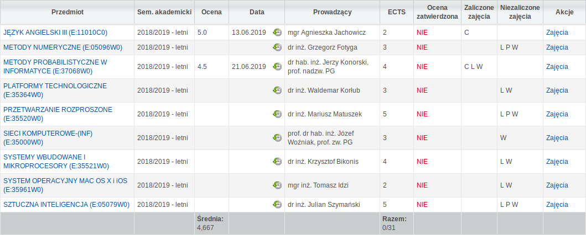

# Userscripts
This is my collection of userscripts.

## Installation
To install any of those scripts you will need an extension like Tampermonkey
([Chrome](https://chrome.google.com/webstore/detail/tampermonkey/dhdgffkkebhmkfjojejmpbldmpobfkfo)
[Firefox](https://addons.mozilla.org/pl/firefox/addon/tampermonkey/))
or Greasemonkey ([Firefox](https://addons.mozilla.org/pl/firefox/addon/greasemonkey/)).

To install any of the scripts click one of the links down below. You should be
prompted with an option to install the script. If that doesn't happen you can
copy its contents and install it manually (refer to your extension's guide for
this).

## Scripts

### MojaPGmean - [install](https://raw.githubusercontent.com/LiquidLemon/userscripts/master/mojapgmean.user.js)

This one calculates your GPA on MojaPG even if your grades are incomplete/not
confirmed yet.

